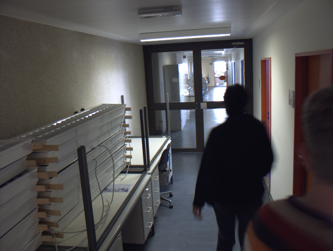
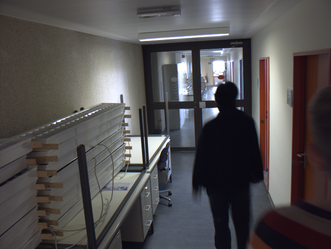

# Übung 1:  Differenzbild

In dieser Übung wird Bewegung mithilfe eines Differenzbildes detektiert. Mithilfe von Bewegungsdetektion können Applikationen
wie z.B. Lichtsteuerungen oder Alarmsysteme gefertigt werden.

Gegeben ist eine statische Kamera, welche 
zwei Bilder in einer zeitlichen Abfolge aufgenommen hat. Die Bilder sehen Sie in den folgenden Abbildungen: 

## Aufgabe a)
Implementieren sie in der Datei `ü1.py` die folgenden Schritte, um die Bewegungsdetektion zu realisieren.

 1. Öffnen Sie die Bilder mit der Funktion `cv2.imread()`
 2. Konvertieren Sie die Bilder in Grauwertbilder mit der Funktion `cv2.cvtColor()`
 3. Erzeugen Sie das Differenzbild unter Ausnutzung des vollen Wertebereichs von 0 bis 1 unter Verwendung der folgenden 
 Punktoperationen:
    - Pixelweise Addition/Subtraktion
    - Addition/Subtraktion einer Konstanten
    - Multiplikation/Division mit einer Konstanten
 4. Stellen Sie das Differenzbild mithilfe von `cv2.imshow()` dar
 5 Setzen Sie alle Pixel mit Intensität kleiner 0.5 auf 0 und zeigen Sie das resultierende Bild an
  

